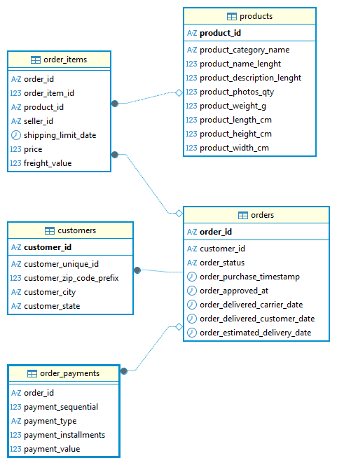

# 📊 Olist E-commerce Logistics & Revenue Audit
**Executive Analysis by Pawel Szopa | Data Analyst & Logistics Operations Specialist**
*Leveraging professional experience from Deutsche Post DHL and Boon Food Group to optimize e-commerce supply chains.*

## 📋 Strategic Business Audit
Analysis of 100k+ records from the Brazilian market (2016-2018), focusing on **Operational Excellence** and **Financial Scaling**.

| Strategic KPI | Value | Professional Insight |
| :--- | :--- | :--- |
| **Gross Revenue** | 15.4M BRL | High-growth scaling identified in late 2017. |
| **Logistics Benchmark** | 8.3 Days | São Paulo (SP) serves as the efficiency baseline for the 3PL network. |
| **Operational Risk** | 29.0 Days | Bottleneck identified in Roraima (RR); critical lead-time variance. |
| **Customer Retention** | 99,441 | Significant market penetration requiring advanced segmentation. |

---

## 🏗️ Data Architecture & Schema

The project operates on a relational model in **PostgreSQL**. Key entities include:
* **Orders**: Central transaction hub.
* **Customers**: Demographics across 27 Brazilian states.
* **Logistics**: Real-time delivery tracking metrics.

---

## 🔍 Advanced Technical Deep-Dives

### 🚛 1. Supply Chain Optimization (Root-Cause Analysis)
Drawing on my background in monitoring **First Time Delivery** rates at DHL, I performed a cross-state lead-time audit.
* **Technique**: Used `EXTRACT(DAY FROM ...)` and `CASE WHEN` to standardize 27 states.
* **Insight**: Remote regions (RR, AP) exhibit a **250% increase** in lead times, indicating a need for regional distribution centers (RDC).

### 📈 2. Revenue Scaling & Trend Analysis
Applying **Revenue Optimization** methods used during my business ownership:
* **Query**: Developed complex joins between `orders` and `order_payments`.
* **Discovery**: The **1.15M BRL peak in Nov 2017** was driven by a specific payment mix (Credit Card vs. Boleto), suggesting high Black Friday elasticity.

### 🎯 3. Data Governance & ETL Workflow
Standardized raw, messy logistics logs into clean, structured SQL tables.
* **Impact**: Reduced data cleaning time for reporting by implementing automated mapping for Brazilian state nomenclature.

---

## 🛠️ Stack & Methodology
* **Engine**: PostgreSQL 15
* **Interface**: DBeaver
* **Techniques**: Window Functions, Complex Case Logic, Data Cleaning (`REPLACE`, `EXTRACT`)

## 🚀 Quick Start
1. Clone the repository.
2. Import the Olist dataset into your SQL engine.
3. Run `Analysis.sql` to generate the full business report.

