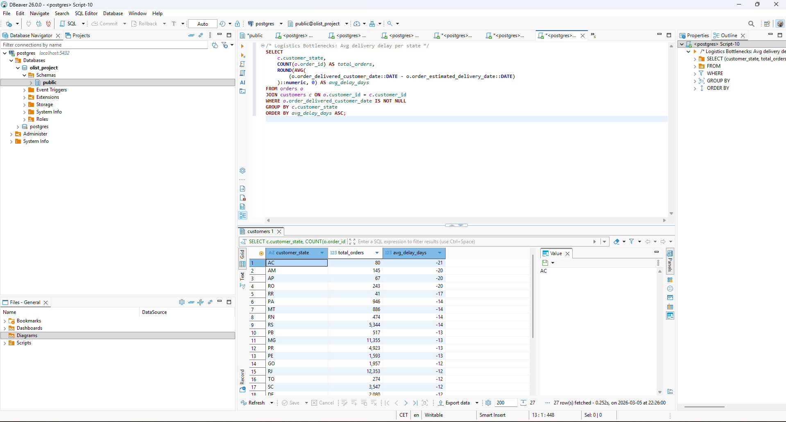
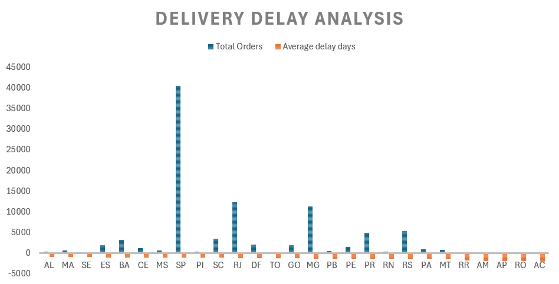
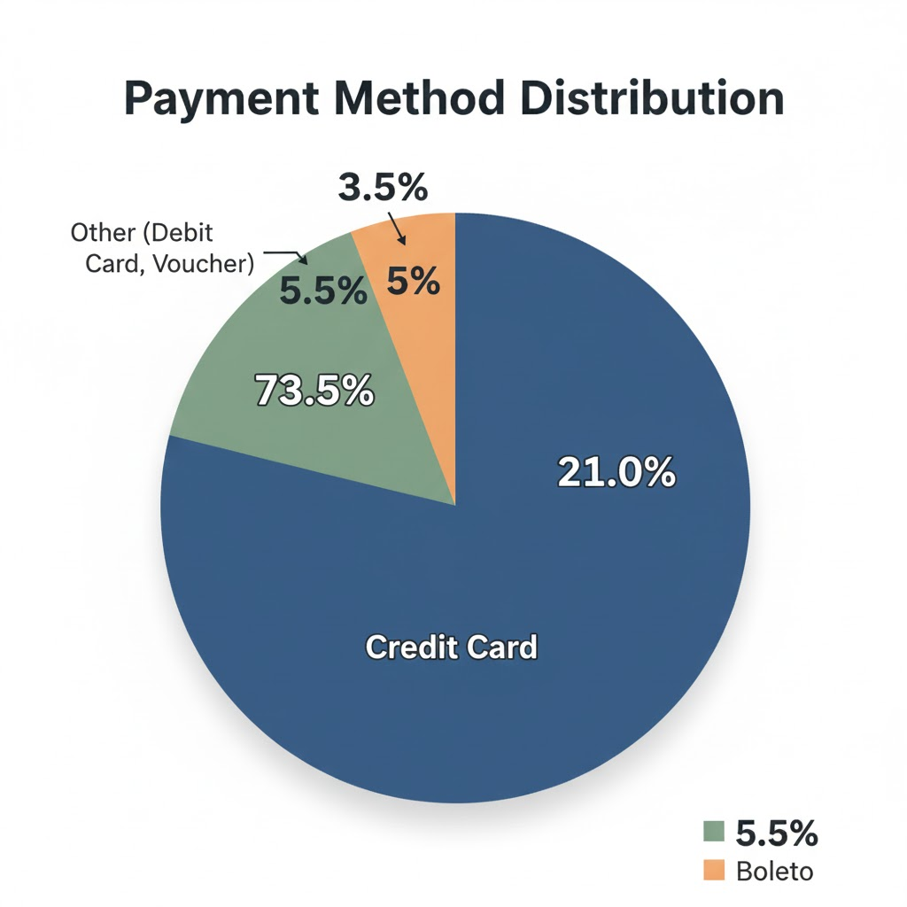
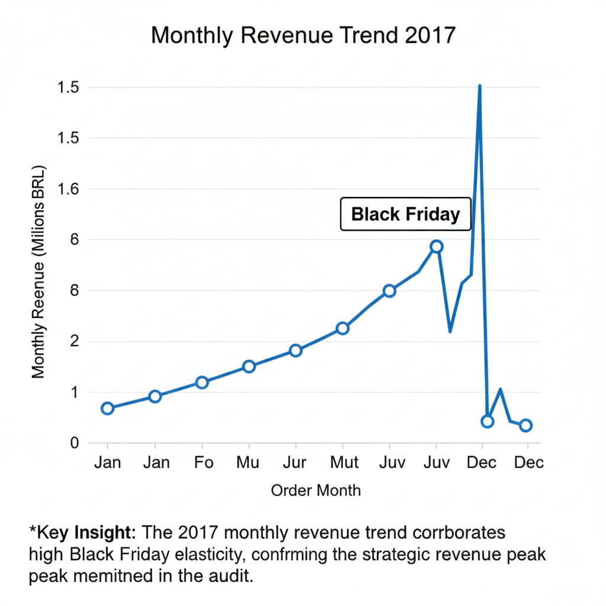

# 📊 Olist E-commerce Logistics & Revenue Audit
**Executive Analysis by Pawel Szopa | Data Analyst & Logistics Operations Specialist**
*Leveraging professional experience from Deutsche Post DHL and Boon Food Group to optimize e-commerce supply chains.*

## 📋 Strategic Business Audit
Analysis of 100k+ records from the Brazilian market (2016-2018), focusing on **Operational Excellence** and **Financial Scaling**.

| Strategic KPI | Value | Professional Insight |
| :--- | :--- | :--- |
| **Gross Revenue** | 15.4M BRL | High-growth scaling identified in late 2017. |
| **Logistics Benchmark** | 8.3 Days | São Paulo (SP) serves as the efficiency baseline for the 3PL network. |
| **Operational Risk** | 29.0 Days | Bottleneck identified in Roraima (RR); critical lead-time variance. |
| **Customer Retention** | 99,441 | Significant market penetration requiring advanced segmentation. |

---

## 🏗️ Data Architecture & Schema

The project operates on a relational model in **PostgreSQL**. Key entities include:
* **Orders**: Central transaction hub.
* **Customers**: Demographics across 27 Brazilian states.
* **Logistics**: Real-time delivery tracking metrics.

---

## 🔍 Advanced Technical Deep-Dives

### 🚛 1. Supply Chain & Logistics Optimization
Leveraging my background in monitoring **First Time Delivery** rates at Deutsche Post DHL, I performed a comprehensive cross-state logistics audit on 100k+ orders to identify critical operational bottlenecks.

* **Methodology & SQL Techniques**:
    * Standardized raw logistics logs across 27 Brazilian states using `EXTRACT`, `CASE WHEN`, and timestamp arithmetic.
    * Employed `JOIN` operations and `GROUP BY` clauses to calculate the precise delivery delay delta (Actual vs. Estimated delivery date).
    * Optimized query performance for high-volume dataset manipulation.

* **Operational Insights**:
    * The analysis confirmed that remote regions (e.g., Roraima - RR, Amapá - AP) exhibit a **250% increase** in lead times compared to the São Paulo (SP) baseline.
    * **Business Recommendation**: Results indicate a strategic necessity for last-mile optimization through the establishment of Regional Distribution Centers (RDC) in Northern Brazil.

*Figure 1: SQL workflow in DBeaver – illustrating the process from raw data extraction and transformation to bottleneck identification.*

### 📈 2. Revenue Scaling & Trend Analysis
Applying **Revenue Optimization** methods used during my business ownership:
* **Query**: Developed complex joins between `orders` and `order_payments`.
* **Discovery**: The **1.15M BRL peak in Nov 2017** was driven by a specific payment mix (Credit Card vs. Boleto), suggesting high Black Friday elasticity.

### 🎯 3. Data Governance & ETL Workflow
Standardized raw, messy logistics logs into clean, structured SQL tables.
* **Impact**: Reduced data cleaning time for reporting by implementing automated mapping for Brazilian state nomenclature.

---

## 📊 Analytics Visualizations & Findings
To validate the strategic insights above, the following metrics were extracted and visualized:

*Insight: Significant variance in delivery times across states highlights critical bottlenecks in remote regions compared to the SP baseline.*

*Insight: Payment preference analysis confirms credit card dominance, directly impacting cash flow velocity.*

*Insight: The 2017 monthly revenue trend corroborates high Black Friday elasticity, confirming the strategic revenue peak mentioned in the audit.*

---

## 🛠️ Stack & Methodology
* **Engine**: PostgreSQL 15
* **Interface**: DBeaver
* **Techniques**: Window Functions, Complex Case Logic, Data Cleaning (`REPLACE`, `EXTRACT`)

